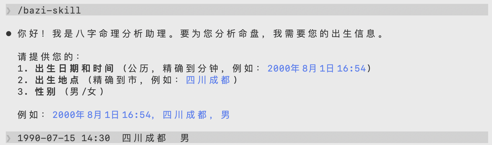
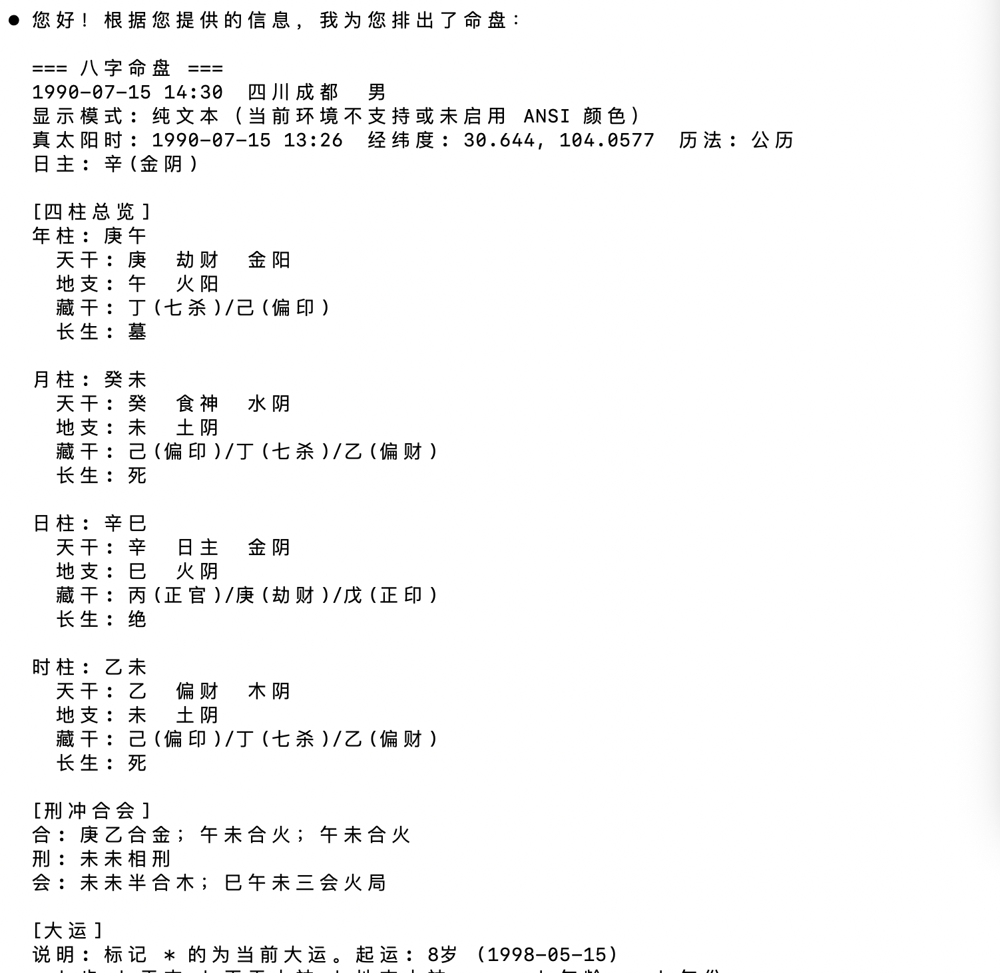
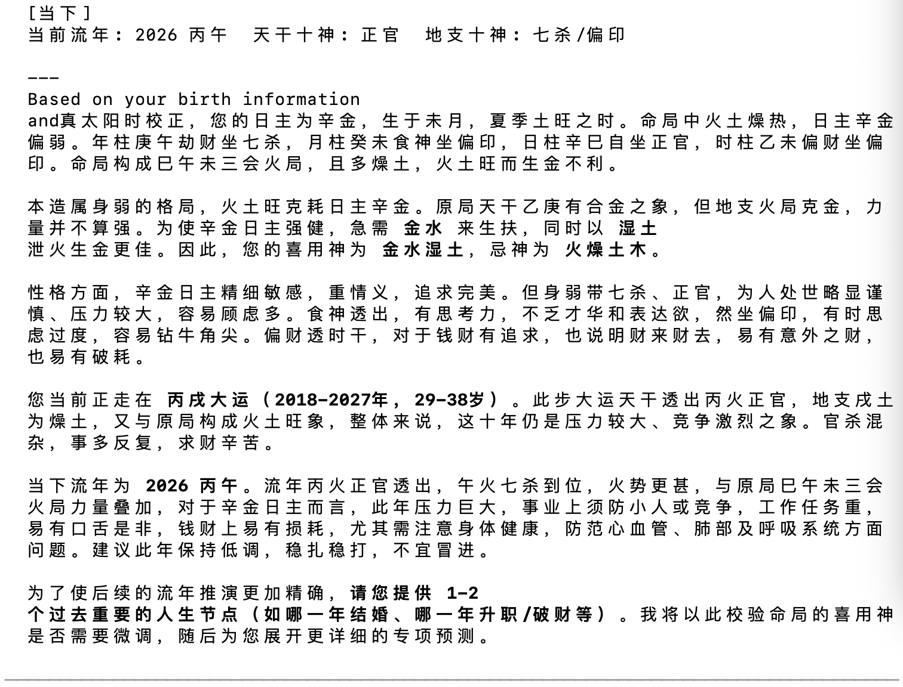

# bazi-skill


把八字排盘、命盘存档与对话式解读，打包成一个真正能落地的 Agent Skill。

不是“会说八字”的提示词壳子，而是一条可执行、可复用、可存档的完整链路。
适用环境：Claude Code、OpenClaw、DeerFlow，以及其他支持读取 SKILL.md 并执行本地命令的 Agent 框架。

> “让 Agent 不只是看起来懂命理，而是真的先算，再讲。”

---

## 1. 核心理念与架构 (Philosophy & Architecture)

**“命理不仅是计算，更是心理疗愈。”** 
很多“算命 Agent”只是包装了语气，但在后台却严重依赖大模型手算四柱，频发致命的干支排错问题；且一旦对话结束便没有任何上下文，无法针对某人的命盘持续追问或建立记忆。

bazi-skill 围绕**推演解耦**与**人文关怀**展开：

- **计算层 (Python)**：承担所有复杂的历法转换、出生地真太阳时校正、五行生克和干支排盘。模型不手算四柱，从根本上消灭排盘幻觉。
- **结构层 (JSON)**：底层脚本输出纯结构化数据给大模型作为隐式上下文，确保流转数据严谨稳定。
- **解读层 (Agent)**：通过 `SKILL.md` 强制约束 Agent 遵循“命定其势，人定其局”的价值观：好运是顺风，不努力只会庸碌度过；差运是冬蛰，向内求索即可平复。提供一套真正的“破局思维”，实现趋吉避凶。

## 2. 核心功能与全景展示 (Features & Showcase)

bazi-skill 并非只提供几个提示词，而是完整包裹了：**交互收集 -> 终端排盘 -> 人文解读 -> 本地存档** 的端到端体验。

### 1️⃣ 对话式的自然参数收集
支持日常使用的**公历（带真太阳时自动校正）**或**农历（含闰月计算）**输入。无论语境如何，Agent 都会自然引导你集齐完整的命理要素。



### 2️⃣ 终端直出排盘
将原本枯燥、极容易陷入大模型幻觉的排盘交给底层 Python 处理，不仅保证算得对，更在你的终端展现色彩分明、格局清晰的排版：



<details>
<summary>👉 点击展开查看：终端纯文本排盘片段示例</summary>

```text
=== 八字命盘 ===
1990-07-15 14:30  四川成都  男
真太阳时: 1990-07-15 13:26  经纬度: 30.644, 104.0577  历法: 公历
日主: 辛(金阴)

[四柱总览]
年柱: 庚午
  天干: 庚  劫财  金阳
  地支: 午  火阳
  藏干: 丁(七杀)/己(偏印)
  长生: 墓
... (略)

[刑冲合会]
合: 庚乙合金；午未合火；午未合火
刑: 未未相刑
会: 未未半合木；巳午未三会火局

[大运]
说明: 标记 => 的为当前大运。起运: 8岁 (1998-05-15)
  | 步 | 干支 | 天干十神 | 地支十神       | 年龄    | 年份     
--+----+------+----------+----------------+---------+----------
   | 1  | 甲申 | 正财     | 劫财/伤官/正印 | 9-18岁  | 1998-2007
   | 2  | 乙酉 | 偏财     | 比肩           | 19-28岁 | 2008-2017
=> | 3  | 丙戌 | 正官     | 正印/比肩/七杀 | 29-38岁 | 2018-2027
...
```
</details>

### 3️⃣ 带有高级同理心的防宿命解读
基于预设的心理疗愈基线，Agent 会温和地剖析原局、推演运势的上下限，并在需要时调用本地存储管理为你创建“私人档案馆”。



## 3. 极简使用指引 (Installation & Workflow)

**你完全不需要手动配置虚拟环境或安装依赖！**
只需将代码克隆到 Agent 支持的技能目录（推荐默认存放路径）：

```bash
git clone https://github.com/yourname/bazi-skill.git ~/.claude/skills/bazi-skill
```

**开始使用：** 直接在对话框中输入 `/bazi-skill`（或向 Agent 提及想要算八字）。

Agent 读取 `SKILL.md` 后会自动接管整个工作流：
1. **环境探测与自修复**：模型会自动检查 Python 环境，并在缺少依赖时利用 `requirements.txt` 自动完成对应模块的安装和兼容性修复。
2. **交互收集**：以自然对话形式引导你补充精准的出生时分与出生地。
3. **结构化运算与存档**：精准调用计算脚本生成 JSON 供大模型深度分析，并在适当的时候自动把命理对象归档留存（基于本地 `~/.bazi_skill/profiles`）。
4. **可视化输出**：将经过颜色高亮与合理排版的命理面板，直接原样呈现在你的终端里。

在这里不仅脚本负责了数学层面的“算”与“存”，Agent 也接管了工程层面的“装”与“问”，体验做到了完全的零门槛开箱即用。

## 4. 流派细则与适用场景 (Astrology Rules)

**内置的流派约束**：
- **子时界定**：早晚子时。23:00-23:59 的日柱依旧算作当天（使用 `sect=2`）。
- **真太阳时**：基于出生城市经纬度自动进行时差校正：真太阳时 = 平太阳时 + (经度 - 120°) × 4 分钟。
- **大运与流年**：男阳女阴顺排，男阴女阳逆排。流年判断以节气**立春**为界，即使公历已过 1月1日，若未到立春，干支仍按上一流年计算。

**适合谁用？**
希望为本地或专属的 AI 提供真正可靠的八字计算能力，而不是仅依赖玄学 prompt 的开发者。无论是对**首次命盘全景分析**，还是对个人经历的**长期阶段性复盘**，`bazi-skill` 旨在为你打造一套个人私有的命运档案馆。

---

<div align="center">
  <i>🕊️ 拒绝封建迷信，弘扬优秀传统文化 🕊️<br>本项目仅供技术研究、AI 边界探索与娱乐参考，命运掌握在自己手中。</i>
</div>

